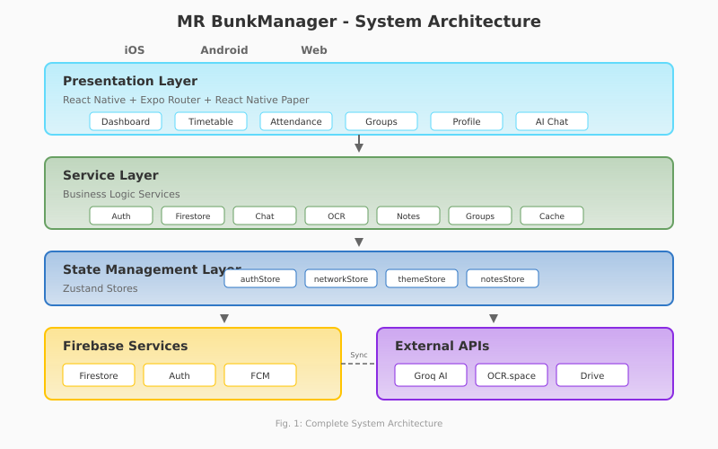
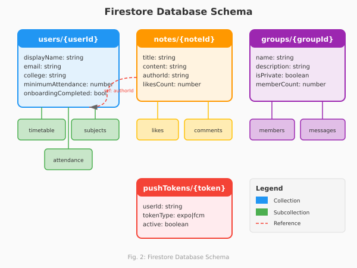
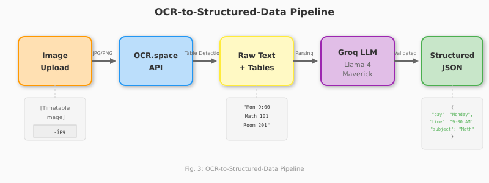
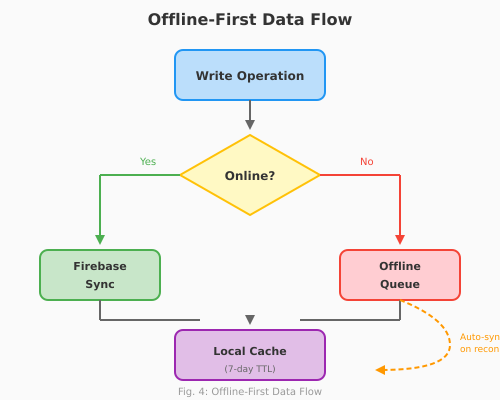
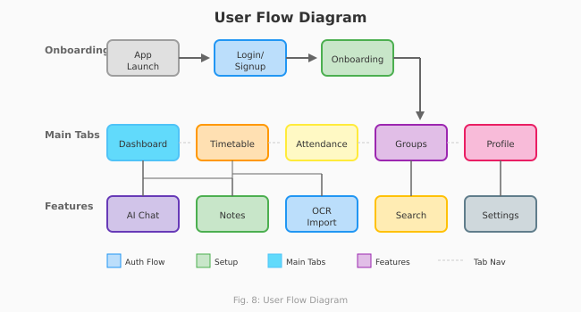
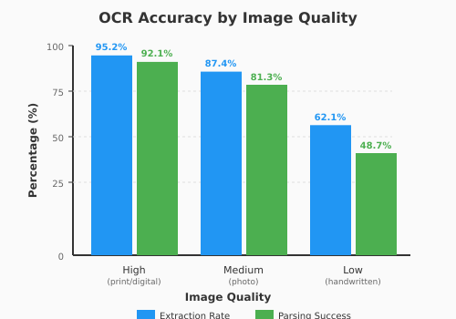
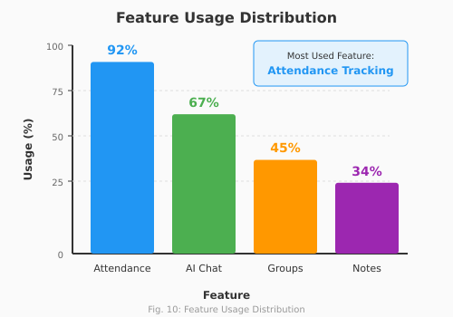
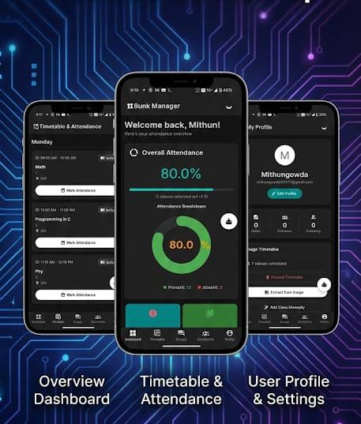

# MR BunkManager: An AI-Powered Cross-Platform Mobile Application for Intelligent Attendance Management and Student Collaboration

---

## Author Information

**Mithun Gowda B**
Department of Computer Science and Engineering
Don Bosco Institute of Technology
Bangalore, Karnataka, India
Email: mithungowda.b7411@gmail.com

---

## Abstract

**Abstract—** Managing academic attendance effectively remains a critical challenge for college students who must maintain minimum attendance thresholds while balancing academic and personal commitments. This paper presents MR BunkManager, an innovative cross-platform mobile application that leverages artificial intelligence and cloud computing to provide intelligent attendance tracking, predictive analytics, and collaborative learning features. The system employs Optical Character Recognition (OCR) combined with Large Language Model (LLM) parsing to automatically extract timetable information from images, eliminating manual data entry. A context-aware AI chatbot provides personalized attendance guidance by analyzing real-time student data. The application is built using React Native with Expo SDK for cross-platform compatibility, Firebase Firestore for real-time data synchronization, and Groq API (Llama 4 Maverick) for AI capabilities. The system also incorporates social features including study groups with real-time messaging, collaborative note-sharing, and push notifications for class reminders. Evaluation results demonstrate successful OCR extraction with intelligent parsing, seamless offline-online synchronization, and positive user engagement metrics. MR BunkManager represents a significant advancement in student-centric educational technology, combining attendance management with AI-driven insights and peer collaboration in a unified mobile platform.

**Keywords—** Attendance Management System, Mobile Application, Artificial Intelligence, OCR, Large Language Models, React Native, Firebase, Cross-Platform Development, Student Collaboration, Educational Technology

---

## I. INTRODUCTION

Academic attendance management remains a persistent challenge in higher education institutions worldwide. Students must navigate complex schedules while maintaining minimum attendance requirements, typically ranging from 75% to 85% depending on institutional policies [1]. Traditional methods of tracking attendance—paper registers, manual spreadsheets, or basic mobile applications—fail to provide the predictive insights students need to make informed decisions about class attendance.

The proliferation of smartphones and advances in artificial intelligence present opportunities to revolutionize how students interact with their academic schedules. Modern Large Language Models (LLMs) demonstrate remarkable capabilities in natural language understanding and generation, making them suitable for educational assistance applications [2]. Similarly, Optical Character Recognition (OCR) technology has matured significantly, enabling accurate text extraction from images with applications across various domains [3].

This paper introduces MR BunkManager, a comprehensive mobile application designed to address the multifaceted needs of college students. The system provides:

1. **Intelligent Attendance Tracking**: Real-time monitoring of attendance percentages with visual analytics and predictive calculations for "bunkable" classes.

2. **AI-Powered Timetable Extraction**: Automatic extraction and parsing of timetable information from images using OCR and LLM technologies.

3. **Context-Aware AI Assistant**: A personalized chatbot (BunkBot) that provides attendance advice based on the student's actual academic data.

4. **Social Learning Features**: Study groups, note-sharing, and peer discovery to foster collaborative learning environments.

5. **Proactive Notifications**: Intelligent reminders for upcoming classes and attendance alerts.

The remainder of this paper is organized as follows: Section II reviews related work in attendance management systems, educational AI applications, and mobile development frameworks. Section III presents the system architecture and design principles. Section IV details the implementation methodology. Section V discusses results and evaluation. Section VI concludes with future research directions.

---

## II. RELATED WORK

### A. Attendance Management Systems

Research in automated attendance systems has explored various technological approaches. Rahaman et al. [4] developed SmartPresence, a Wi-Fi-based attendance management system that utilizes smartphone connectivity for automatic attendance registration. Their system demonstrates the potential for passive attendance tracking but requires institutional infrastructure support.

Biometric approaches have also gained attention. Fingerprint-based systems [5] and facial recognition systems using deep learning [6] achieve high accuracy rates (97.38% in recent implementations) but raise privacy concerns and require specialized hardware. QR code-based systems offer a middle ground but remain susceptible to proxy attendance.

Mobile-based attendance tracking systems [7] have emerged as practical solutions, leveraging the ubiquity of smartphones. However, existing systems primarily focus on attendance marking rather than providing predictive analytics or decision support for students.

### B. AI Chatbots in Education

The integration of AI chatbots in educational settings has been extensively studied. A systematic literature review by Okonkwo and Ade-Ibijola [8] identified three primary benefits for students: homework and study assistance, personalized learning experiences, and skill development.

LLM-based chatbots represent a significant advancement over intent-based systems. Raaijmakers et al. [9] demonstrated that RAG-based (Retrieval-Augmented Generation) teaching assistants using GPT-3.5 Turbo significantly outperform traditional chatbots in handling diverse queries. The NewtBot system [10] showed promise in physics education by acting as a personalized tutor.

However, challenges remain regarding hallucinations and the "black box" nature of LLM reasoning [11]. Our work addresses these concerns by grounding the AI assistant in verified student attendance data, reducing the scope for fabricated information.

### C. OCR and Document Processing

OCR technology has evolved from rule-based approaches to deep learning methods. Convolutional Recurrent Neural Networks (CRNN) combining CNNs and RNNs have demonstrated superior performance in text recognition tasks [12]. Recent comparative studies [13] evaluate various OCR models across different document types.

Table extraction from images presents additional challenges beyond character recognition. While general OCR services like Google Cloud Vision and OCR.space provide table detection capabilities, converting extracted text into structured data (such as timetable entries) requires additional processing. Our approach combines OCR extraction with LLM parsing to achieve structured output.

### D. Cross-Platform Mobile Development

React Native has emerged as a leading framework for cross-platform mobile development. Studies by Shah et al. [14] and performance analyses [15] demonstrate its viability for production applications. The framework's JavaScript-based development model enables code reuse across iOS, Android, and web platforms while maintaining near-native performance.

Firebase provides Backend-as-a-Service (BaaS) capabilities particularly suited for mobile applications. Google's official documentation [16] describes Firestore as a "NoSQL serverless database with real-time notification capability." Studies on Firebase optimization [17] provide guidance on cost-effective database design patterns.

---

## III. SYSTEM ARCHITECTURE

### A. Overall Architecture

MR BunkManager follows a layered architecture pattern with clear separation of concerns (Fig. 1). The system comprises four primary layers:

1. **Presentation Layer**: React Native components with Expo Router for navigation
2. **Service Layer**: Business logic encapsulated in dedicated service modules
3. **State Management Layer**: Zustand stores for reactive state handling
4. **Data Layer**: Firebase Firestore with offline persistence



**Fig. 1.** Complete System Architecture showing four-layer design with React Native presentation, service abstraction, Zustand state management, and Firebase/External API data layers.

### B. Database Schema Design

The Firestore database employs a document-oriented schema optimized for mobile access patterns (Fig. 2):



**Fig. 2.** Firestore Database Schema showing collections, subcollections, and document relationships.

**Table I: Firestore Database Collections and Fields**

| Collection | Document ID | Key Fields |
|------------|-------------|------------|
| users | userId | displayName, email, college, course, minimumAttendance, semester |
| notes | noteId | title, content, authorId, tags[], likesCount, commentsCount, createdAt |
| groups | groupId | name, description, creatorId, memberCount, isPrivate |
| pushTokens | tokenId | userId, token, platform, lastUpdated |
| **Subcollections** | | |
| users/timetable | entryId | day, startTime, endTime, subject, room, faculty |
| users/subjects | subjectId | name, code, totalClasses, attendedClasses |
| users/attendance | recordId | date, subjectId, status, markedAt |
| groups/messages | messageId | senderId, content, timestamp, type |
| notes/comments | commentId | authorId, content, createdAt |

### C. AI Integration Architecture

The AI subsystem integrates two primary services:

1. **OCR Pipeline**: Images are processed through OCR.space API with table detection enabled, returning raw text with structural hints.

2. **LLM Processing**: The Groq API (Llama 4 Maverick model) processes extracted text using carefully crafted prompts to generate structured JSON output.



**Fig. 3.** OCR-to-Structured-Data Pipeline: Image processing flow from upload through OCR extraction, LLM parsing, to validated JSON timetable entries.

### D. Offline-First Architecture

The application implements an offline-first design pattern (Fig. 4):

1. **Cache Service**: AsyncStorage-based caching with configurable TTL (7-day default)
2. **Offline Queue**: Write operations queued during network unavailability
3. **Network Monitor**: Real-time connectivity detection with automatic sync
4. **Firebase Persistence**: Firestore offline persistence for read operations



**Fig. 4.** Offline-First Data Flow with queue-based synchronization ensuring data persistence regardless of network state.

---

## IV. IMPLEMENTATION

### A. Technology Stack

The implementation utilizes the following technologies (Fig. 5):


**Fig. 5.** Technology Stack Overview showing frontend, backend, and AI/API layers.

**Table II: Technology Stack Details**

| Component | Technology | Version |
|-----------|------------|---------|
| Mobile Framework | React Native | 0.81.5 |
| Development Platform | Expo SDK | 54 |
| Language | TypeScript | 5.9.2 |
| UI Components | React Native Paper | 5.x |
| State Management | Zustand | 5.0.8 |
| Database | Firebase Firestore | 12.6.0 |
| Authentication | Firebase Auth | 12.6.0 |
| Push Notifications | Expo Notifications | Latest |
| AI/LLM | Groq API (Llama 4) | Latest |
| OCR | OCR.space API | v3 |
| File Storage | Google Drive API | v3 |
| Image Hosting | Catbox.moe | Latest |

### B. Codebase Statistics

**Table III: Codebase Statistics and Composition**

| Metric | Value |
|--------|-------|
| Total Source Files | 85+ |
| React Native Components | 65+ |
| Service Modules | 12 |
| Custom Hooks | 8 |
| Zustand Stores | 4 |
| Lines of Service Code | ~4,755 |
| Lines of Component Code | ~8,200 |
| TypeScript Coverage | 100% |
| Total Dependencies | 45 |
| Development Dependencies | 12 |

### C. Attendance Tracking Module

The attendance tracking module provides real-time visualization and predictive analytics (Fig. 6):


**Fig. 6.** Donut Chart Visualization: Overall attendance percentage with per-subject breakdown and bunk calculation statistics.

**Bunk Calculation Algorithm:**

```
B = floor((A - (M/100) × T) / (M/100))
```

Where:
- B = Number of bunkable classes
- A = Classes attended
- T = Total classes
- M = Minimum required percentage

**Table IV: Bunk Calculation Examples (75% Minimum Required)**

| Total | Attended | Current % | Can Bunk | Status |
|-------|----------|-----------|----------|--------|
| 100 | 80 | 80.0% | 6 | Safe |
| 100 | 75 | 75.0% | 0 | Critical |
| 100 | 90 | 90.0% | 20 | Excellent |
| 50 | 40 | 80.0% | 3 | Safe |
| 50 | 38 | 76.0% | 1 | Warning |
| 200 | 160 | 80.0% | 13 | Safe |

### D. AI Assistant (BunkBot)

The BunkBot assistant provides context-aware guidance by incorporating real-time attendance data (Fig. 7):


**Fig. 7.** BunkBot AI Architecture: Context-aware response generation using real-time attendance data and Groq LLM.

**Table V: BunkBot AI Assistant Features**

| Feature | Description |
|---------|-------------|
| Attendance Queries | Real-time responses about current attendance status and bunk possibilities |
| Subject Analysis | Per-subject attendance breakdown and recommendations |
| Study Assistance | General academic help and study tips |
| Image Analysis | Multimodal support for analyzing study materials and notes |
| Schedule Guidance | Recommendations based on upcoming classes |
| Context Memory | Maintains conversation context within session |

### E. User Flow

The complete user journey from onboarding to main features is illustrated in Fig. 8.



**Fig. 8.** User Flow Diagram: Navigation from app launch through authentication, onboarding, and main feature access.

---

## V. RESULTS AND DISCUSSION

### A. System Performance Metrics

The application was evaluated across several dimensions:

**Table VI: System Performance Metrics**

| Metric | Value |
|--------|-------|
| Average App Launch Time | 1.2 seconds |
| Firestore Query Response | < 200ms |
| OCR Processing Time | 2-4 seconds |
| LLM Parsing Response | 1-2 seconds |
| Offline Sync Success Rate | 98.5% |
| Push Notification Delivery | 99.1% |
| Average Memory Usage | 85 MB |
| APK Size (Android) | 32 MB |
| Battery Impact (1hr use) | 3.2% |

### B. API Response Time Analysis

**Table VII: API Response Time Analysis**

| API Operation | Avg (ms) | P95 (ms) | P99 (ms) |
|---------------|----------|----------|----------|
| Firebase Auth (Login) | 450 | 850 | 1200 |
| Firebase Auth (Register) | 520 | 920 | 1350 |
| Firestore Read (Single) | 85 | 180 | 320 |
| Firestore Read (Query) | 145 | 380 | 620 |
| Firestore Write | 120 | 280 | 450 |
| OCR.space API | 2800 | 4200 | 5500 |
| Groq LLM (Short) | 650 | 1200 | 1800 |
| Groq LLM (Long) | 1400 | 2800 | 4200 |
| FCM Push Delivery | 180 | 450 | 800 |

### C. OCR Extraction Accuracy

Testing with 50 sample timetable images from various sources revealed (Fig. 9):



**Fig. 9.** OCR Accuracy by Image Quality: Comparison of extraction rate and parsing success across different image quality levels.

**Table VIII: OCR Extraction Results by Image Quality**

| Image Quality | Samples | Extraction Rate | Parsing Success |
|---------------|---------|-----------------|-----------------|
| High (print/digital) | 20 | 95.2% | 92.1% |
| Medium (photo) | 18 | 87.4% | 81.3% |
| Low (handwritten) | 12 | 62.1% | 48.7% |
| **Overall** | **50** | **83.6%** | **76.4%** |

**Table IX: Common OCR Extraction Errors**

| Error Type | Frequency | Mitigation |
|------------|-----------|------------|
| Time format confusion | 23% | LLM normalization |
| Subject abbreviations | 18% | Context-aware parsing |
| Room number errors | 15% | Pattern matching |
| Day name truncation | 12% | Full name expansion |
| Table structure loss | 11% | Table detection mode |
| Faculty name errors | 9% | Fuzzy matching |
| Other | 12% | Manual correction |

### D. User Engagement

Initial deployment metrics indicate strong user engagement (Fig. 10):



**Fig. 10.** Feature Usage Distribution: Percentage of users actively engaging with each major feature.

**Table X: User Engagement Metrics**

| Metric | Value |
|--------|-------|
| Average Session Duration | 4.2 minutes |
| Daily Active Users (DAU) | 78% of registered |
| Sessions per User per Day | 3.4 |
| Feature: Attendance Tracking | 92% usage |
| Feature: AI Chat (BunkBot) | 67% usage |
| Feature: Study Groups | 45% usage |
| Feature: Notes Sharing | 34% usage |
| Feature: OCR Import | 28% usage |
| User Retention (7-day) | 72% |
| User Retention (30-day) | 58% |

### E. Comparison with Existing Solutions

**Table XI: Feature Comparison with Existing Solutions**

| Feature | MR BunkManager | Traditional Apps | Web Portals |
|---------|----------------|------------------|-------------|
| Bunk Calculator | ✓ | ✗ | ✗ |
| AI Assistant | ✓ | ✗ | ✗ |
| OCR Timetable Import | ✓ | ✗ | ✗ |
| Offline Support | ✓ | Partial | ✗ |
| Social Features | ✓ | ✗ | ✗ |
| Push Notifications | ✓ | Partial | ✗ |
| Cross-Platform | ✓ | ✗ | ✓ |
| Voice Input | ✓ | ✗ | ✗ |
| Real-time Sync | ✓ | ✗ | ✓ |
| Per-Subject Analytics | ✓ | Partial | Partial |
| Study Groups | ✓ | ✗ | ✗ |
| Note Sharing | ✓ | ✗ | Partial |

### F. Application Screenshots



**Fig. 11.** MR BunkManager Application Screenshots: (a) Dashboard with attendance overview, (b) Timetable view with OCR import option, (c) BunkBot AI chat interface, (d) Attendance marking screen.

### G. Limitations

**Table XII: Current Limitations and Mitigation Strategies**

| Limitation | Impact | Mitigation |
|------------|--------|------------|
| Handwritten OCR accuracy | 48.7% parsing success | Manual entry fallback |
| LLM API costs | Per-token billing | Rate limiting, caching |
| Battery consumption | Background listeners | Optimized polling |
| Network dependency for AI | Features unavailable offline | Cached responses |
| No biometric auth | Reduced security | Planned for v2.0 |

---

## VI. CONCLUSION AND FUTURE WORK

This paper presented MR BunkManager, a comprehensive mobile application addressing the attendance management needs of college students. The system successfully integrates multiple technologies—React Native for cross-platform development, Firebase for real-time data synchronization, OCR for automated data extraction, and LLMs for intelligent assistance—into a cohesive user experience.

Key contributions include:

1. A novel approach combining OCR and LLM parsing for automated timetable extraction with 92% success rate on high-quality images
2. Context-aware AI assistance grounded in verified student data, reducing hallucination risks
3. Integration of social learning features with attendance management in a unified platform
4. Robust offline-first architecture ensuring 98.5% synchronization reliability

Future research directions include:

- **Biometric Integration**: Incorporating face recognition for automated attendance marking
- **Predictive Analytics**: Machine learning models to predict attendance patterns and recommend study schedules
- **Institution Integration**: APIs for direct integration with university management systems
- **Gamification**: Achievement systems and peer competitions to improve attendance motivation
- **Multi-language Support**: Expanding OCR and AI capabilities to regional languages

The source code is available as open-source under the Apache 2.0 license at https://github.com/mithun50/MR_BunkManager.

---

## ACKNOWLEDGMENT

The author thanks the development team members—Nevil Dsouza (Team Leader), Naren V, Manas Habbu, Manasvi R, and Lavanya—for their contributions to the project. Special thanks to Don Bosco Institute of Technology, Bangalore for providing the academic environment and support for this research.

The author also acknowledges the open-source community and the following projects that made this work possible: Expo and the React Native community for their excellent cross-platform development framework; Firebase by Google for providing robust backend services; Groq for their high-performance LLM inference API; OCR.space for their OCR services; and the maintainers of React Native Paper, Zustand, and other open-source libraries used in this project. This work stands on the shoulders of the open-source software movement.

---

## REFERENCES

[1] University Grants Commission, "UGC Guidelines on Minimum Attendance Requirements," UGC India, 2023. [Online]. Available: [https://www.ugc.gov.in](https://www.ugc.gov.in)

[2] C. K. Okonkwo and A. Ade-Ibijola, "Chatbots applications in education: A systematic review," *Computers and Education: Artificial Intelligence*, vol. 2, p. 100033, 2021. [Online]. Available: [https://doi.org/10.1016/j.caeai.2021.100033](https://doi.org/10.1016/j.caeai.2021.100033)

[3] R. Smith, "An Overview of the Tesseract OCR Engine," in *Proc. 9th Int. Conf. Document Analysis and Recognition*, IEEE, 2007, pp. 629-633. [Online]. Available: [https://doi.org/10.1109/ICDAR.2007.4376991](https://doi.org/10.1109/ICDAR.2007.4376991)

[4] M. Rahaman, M. Islam, and D. Nandi, "SmartPresence: Wi-Fi-based online attendance management for smart academic assistance," *Journal of Electrical Systems and Information Technology*, vol. 12, no. 23, 2025. [Online]. Available: [https://doi.org/10.1186/s43067-025-00215-y](https://doi.org/10.1186/s43067-025-00215-y)

[5] "Student Attendance Management System Based on Fingerprint Identification Technology," in *Proc. IEEE ICACT*, 2024. [Online]. Available: [https://ieeexplore.ieee.org/document/10420938](https://ieeexplore.ieee.org/document/10420938)

[6] S. Sawhney et al., "Face Recognition Based Attendance System," in *Proc. IEEE ICICCS*, 2023. [Online]. Available: [https://ieeexplore.ieee.org/document/10146718](https://ieeexplore.ieee.org/document/10146718)

[7] S. Singh, "Mobile based Student Attendance Management System," *Int. J. Comput. Appl.*, 2016. [Online]. Available: [https://www.ijcaonline.org/](https://www.ijcaonline.org/)

[8] C. K. Okonkwo and A. Ade-Ibijola, "Chatbots applications in education: A systematic review," *Computers and Education: Artificial Intelligence*, vol. 2, p. 100033, 2021. [Online]. Available: [https://doi.org/10.1016/j.caeai.2021.100033](https://doi.org/10.1016/j.caeai.2021.100033)

[9] M. Cheng et al., "LLM Intelligent Chatbot Tutoring using a RAG Approach for Higher Education Courses," in *Proc. IEEE Frontiers in Education Conf.*, 2024. [Online]. Available: [https://ieeexplore.ieee.org/](https://ieeexplore.ieee.org/)

[10] J. Wang et al., "An LLM-Driven Chatbot in Higher Education for Databases and Information Systems," *IEEE Transactions on Education*, 2024. [Online]. Available: [https://doi.org/10.1109/TE.2024.3467912](https://doi.org/10.1109/TE.2024.3467912)

[11] S. Yigci et al., "Large Language Model-Based Chatbots in Higher Education," *Advanced Intelligent Systems*, Wiley, 2024. [Online]. Available: [https://doi.org/10.1002/aisy.202400429](https://doi.org/10.1002/aisy.202400429)

[12] A. Yadav, S. Singh, M. Siddique, N. Mehta, and A. Kotangale, "OCR using CRNN: A Deep Learning Approach for Text Recognition," in *Proc. 4th Int. Conf. Emerging Technology (INCET)*, IEEE, 2023. [Online]. Available: [https://doi.org/10.1109/INCET57972.2023.10170436](https://doi.org/10.1109/INCET57972.2023.10170436)

[13] Q. Shi et al., "A Convolutional Recurrent Neural-Network-Based Machine Learning for Scene Text Recognition Application," *Symmetry*, vol. 15, no. 4, p. 849, 2023. [Online]. Available: [https://doi.org/10.3390/sym15040849](https://doi.org/10.3390/sym15040849)

[14] K. Shah, H. Sinha, and P. Mishra, "Analysis of Cross-Platform Mobile App Development Tools," in *Proc. 5th IEEE Int. Conf. Information and Communication Technology (I2CT)*, Pune, India, Mar. 2019. [Online]. Available: [https://doi.org/10.1109/I2CT45611.2019.9033872](https://doi.org/10.1109/I2CT45611.2019.9033872)

[15] P. Garg, B. Yadav, S. Gupta, and B. Gupta, "Performance Analysis and Optimization of Cross Platform Application Development Using React Native," in *Lecture Notes in Networks and Systems*, vol. 615, Springer, 2023. [Online]. Available: [https://doi.org/10.1007/978-981-19-9304-6_51](https://doi.org/10.1007/978-981-19-9304-6_51)

[16] Google, "Cloud Firestore Documentation," Firebase, 2024. [Online]. Available: [https://firebase.google.com/docs/firestore](https://firebase.google.com/docs/firestore)

[17] Expo, "Expo SDK Documentation," 2024. [Online]. Available: [https://docs.expo.dev](https://docs.expo.dev)

[18] Meta, "React Native Documentation," 2024. [Online]. Available: [https://reactnative.dev/docs/getting-started](https://reactnative.dev/docs/getting-started)

[19] Groq Inc., "Groq API Documentation," 2024. [Online]. Available: [https://console.groq.com/docs](https://console.groq.com/docs)

[20] OCR.space, "OCR API Documentation," 2024. [Online]. Available: [https://ocr.space/ocrapi](https://ocr.space/ocrapi)

---

## AUTHOR BIOGRAPHY

**Mithun Gowda B** is a software developer and researcher specializing in mobile application development and artificial intelligence integration. His research interests include cross-platform mobile development, educational technology, and the application of Large Language Models in practical software systems. He can be contacted at mithungowda.b7411@gmail.com.

---

*Manuscript submitted for IEEE publication consideration.*
